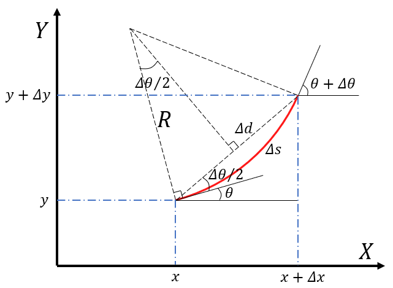

# Kinematics
两轮差速轮机器人在全局参考坐标系下的位姿为 $\mathbf{x} = [x, y, \theta]^T$ ，其中 $x$ 和 $y$ 表示机器人的位置， $\theta$ 表示机器人的航向角，其运动学方程如下所示：

$$
\begin{cases}
\begin{aligned}
    \dot{x} &= v \cos \theta \\
    \dot{y} &= v \sin \theta \\
    \dot{\theta} &= \omega 
\end{aligned} 
\end{cases}
\tag{1}
$$

其中 $v$ 为线速度， $\omega$ 为角速度.

安装在机器人左右两边轮子上的编码器可以测量出轮子在 $\Delta t$ 时间内的转动角度，已知轮子的半径，可以计算在 $\Delta t$ 时间内机器人的左右轮子走过的路程 $\Delta s_l$ 和 $\Delta s_r$ ，假设两个轮子之间的距离为 $L$ ，则机器人在 $\Delta t$ 时间内的航向角变化量为

$$
\Delta \theta = \frac{\Delta s_l}{R - \frac{L}{2}} = \frac{\Delta s_r}{R + \frac{L}{2}} = \frac{\Delta s}{R} \tag{2}
$$

其中， $R$ 为转弯半径. 根据公式 $(2)$ ，可以计算出机器人在 $\Delta t$ 时间内的航向角变化量 $\Delta \theta$ 为

$$
\Delta \theta = \frac{\Delta s_r - \Delta s_l }{L} \tag{3}
$$

也可以计算出机器人在 $\Delta t$ 时间内的路程变化量 $\Delta s$ 为

$$
\Delta s = \frac{\Delta s_r + \Delta s_l }{2} \tag{4}
$$

以下介绍3种方法，根据编码器得到的左右轮子走过的路程 $\Delta s_l$ 和 $\Delta s_r$ ，计算机器人在参考坐标系下的位姿 $[x, y, \theta]^T$ .

#### 方法1

离散状态方程的一般形式为 $\mathbf{x}_{k+1} = \mathbf{x}_k + \Delta \mathbf{x}_k$ ，即

$$
\begin{cases}
\begin{aligned}
    x_{k+1} &= x_k + \Delta x_k \\
    y_{k+1} &= y_k + \Delta y_k \\
    \theta_{k+1} &= \theta_k + \Delta \theta_k 
\end{aligned} 
\end{cases}
\tag{5}
$$

假设 $\Delta t$ 足够小，机器人在 $\Delta t$ 时间内的运动过程可以近似为匀速直线运动. 

机器人在 $k$ 时刻的航向角变化量 $\Delta \theta_k = \Delta t_k \cdot \omega_k$ ，根据假设，机器人在 $k$ 时刻的路程变化量为 $\Delta s_k \simeq \Delta t_k \cdot v_k$ ， $x$ 位置的变化量 $\Delta x_k \simeq \Delta s_k \cdot \cos \theta_k$， $y$ 位置的变化量 $\Delta y_k \simeq \Delta s_k \cdot \sin \theta_k$，这就是将两轮差速轮机器人的连续状态方程，即公式 $(1)$ ，转换为离散状态方程的一般形式，即

$$ 
\begin{cases}
\begin{aligned}
    x_{k+1} &= x_k + \Delta t_k \cdot v_k  \cdot \cos \theta_k \\
    y_{k+1} &= y_k + \Delta t_k \cdot v_k  \cdot \sin \theta_k \\
    \theta_{k+1} &= \theta_k + \Delta t_k \cdot \omega_k
\end{aligned} 
\end{cases}
\tag{6}
$$

结合公式 $(3)$ 和公式 $(4)$ ，可以得到：

$$ 
\begin{cases}
\begin{aligned}
    x_{k+1} &= x_k + \frac{\Delta s_{r,k} + \Delta s_{l,k} }{2} \cos \theta_k \\
    y_{k+1} &= y_k + \frac{\Delta s_{r,k} + \Delta s_{l,k} }{2} \sin \theta_k \\
    \theta_{k+1} &= \theta_k + \frac{\Delta s_{r,k} - \Delta s_{l,k} }{L} 
\end{aligned} 
\end{cases}
\tag{7}
$$

使用公式 $(7)$ 可以实现根据编码器数据更新机器人在参考坐标系下的位姿. [Rohan P. Singh在github的开源代码](https://github.com/rohanpsingh/encoder-odometry/blob/master/encoder_odometry/src/odometry.cpp)就是根据这样的方法计算轮式里程计.

#### 方法2

方法1假设 $\Delta t$ 足够小，将机器人运动近似为匀速直线运动. 但是在实际应用中， $\Delta t$ 一般不会足够小，可以将机器人在 $k$ 时刻的路程变化量，近似为机器人在 $k$ 时刻的位置和机器人在 $k+1$ 时刻的位置的位移差，即 $\Delta s_k \simeq \Delta d_k \simeq \Delta t_k \cdot v_k$

如图所示，在方法1的基础上，对机器人在 $k$ 时刻的位置变化量的计算进行改进

$$
\begin{aligned}
\Delta x_k &= \Delta d_k \cdot \cos \left(\theta_k + \frac{\Delta \theta_k}{2}\right) \simeq \Delta s_k \cdot \cos \left(\theta_k + \frac{\Delta \theta_k}{2}\right)  \\
\Delta y_k &= \Delta d_k \cdot \sin \left(\theta_k + \frac{\Delta \theta_k}{2}\right) \simeq \Delta s_k \cdot \sin \left(\theta_k + \frac{\Delta \theta_k}{2}\right)
\end{aligned}
\tag{8}
$$

机器人在 $k$ 时刻的航向角变化量 $\Delta \theta_k = \Delta t_k \cdot \omega_k$ ，结合公式 $(3)$ 、公式 $(4)$ 和公式 $(8)$ ，可以得到：

$$ 
\begin{cases}
\begin{aligned}
    x_{k+1} &= x_k + \frac{\Delta s_{r,k} + \Delta s_{l,k} }{2} \cos \left(\theta_k + \frac{\Delta s_{r,k} - \Delta s_{l,k} }{2L}\right) \\
    y_{k+1} &= y_k + \frac{\Delta s_{r,k} + \Delta s_{l,k} }{2} \sin \left(\theta_k + \frac{\Delta s_{r,k} - \Delta s_{l,k} }{2L}\right) \\
    \theta_{k+1} &= \theta_k + \frac{\Delta s_{r,k} - \Delta s_{l,k} }{L} 
\end{aligned} 
\end{cases}
\tag{9}
$$

使用公式 $(9)$ 可以实现根据编码器数据更新机器人在参考坐标系下的位姿. [Emmanuel使用DrRobot X80实现SLAM的demo](https://github.com/A01371852/ROS_Autonomous_SLAM/blob/master/catkin_ws/src/drrobot_X80_player/src/drrobot_odometry.cpp)就是根据这样的方法计算轮式里程计.

#### 方法3

假设 $\Delta t$ 较大，并且机器人在 $\Delta t$ 时间内的线速度和角速度保持不变，机器人在 $\Delta t$ 时间内的运动过程可以用圆弧运动来近似. 

根据假设，结合公式 $(3)$ 和公式 $(4)$ ，机器人在 $k$ 时刻的转弯半径 $R_k$ 为

$$
R_k = \frac{\Delta s_k}{\Delta \theta_k} = \frac{L}{2} \cdot \frac{\Delta s_{r,k} + \Delta s_{l,k}}{\Delta s_{r,k} - \Delta s_{l,k}} \tag{10}
$$

如上图所示，机器人在 $k$ 时刻的 $x$ 位置的变化量 $\Delta x_k$ 和 $y$ 位置的变化量 $\Delta y_k$ 可以分别表示为

$$
\begin{cases}
\begin{aligned}
    \Delta x_k &=  R_k \cdot \sin (\theta_k + \Delta \theta_k) - R_k \cdot \sin \theta_k \\
    \Delta y_k &= -R_k \cdot \cos (\theta_k + \Delta \theta_k) + R_k \cdot \cos \theta_k
\end{aligned}
\end{cases}
\tag{11}
$$

结合公式 $(3)$ 和公式 $(11)$ ，可以得到：

$$ 
\begin{cases}
\begin{aligned}
    x_{k+1} &= x_k + R_k \cdot \sin (\theta_k + \frac{\Delta s_{r,k} - \Delta s_{l,k} }{L}) - R_k \cdot \sin \theta_k \\
    y_{k+1} &= y_k - R_k \cdot \cos (\theta_k + \frac{\Delta s_{r,k} - \Delta s_{l,k} }{L}) + R_k \cdot \cos \theta_k \\
    \theta_{k+1} &= \theta_k + \frac{\Delta s_{r,k} - \Delta s_{l,k} }{L} 
\end{aligned} 
\end{cases}
\tag{12}
$$

使用公式 $(10)$ 和公式 $(12)$ 可以实现根据编码器数据更新机器人在参考坐标系下的位姿. [Autonomy Lab at SFU在github上开源的iRobot扫地机驱动](https://github.com/AutonomyLab/libcreate/blob/master/src/create.cpp)就是根据这样的方法计算轮式里程计.

# Dynamic

轮式编码器可以测量出在 $\Delta t$ 时间内机器人的左右轮子走过的路程 $\Delta s_l$ 和 $\Delta s_r$ ，那么机器人在 $k$ 时刻的左右轮子的速度(speed) $v_{l,k}$ 和 $v_{r,k}$ 可以表示为

$$
v_{l,k} = \frac{\Delta s_{l,k}}{\Delta t_k} \ \ \ \ \  v_{r,k} = \frac{\Delta s_{r,k}}{\Delta t_k} \tag{13}
$$

根据公式 $(3)$ 和公式 $(4)$ ，机器人在 $k$ 时刻的线速度 $v_k$ 和角速度 $\omega_k$ 可以表示为

$$
\begin{cases}
\begin{aligned}
    v_{k} &= \frac{\Delta s_k}{\Delta t_k} = \frac{\Delta s_{r,k} + \Delta s_{l,k}}{2 \cdot \Delta t_k} \\
    \omega_{k} &= \frac{\Delta \theta_k}{\Delta t_k} = \frac{\Delta s_{r,k} - \Delta s_{l,k}}{L \cdot \Delta t_k}
\end{aligned} 
\end{cases}
\tag{14}
$$

# Error Model

已知输入变量 $\mathbf{x} = [x_1, \cdots, x_n]^T$ 的概率分布和函数 $\mathbf{y} = \mathbf{f}(\mathbf{x})$ ，根据误差传播定律，将函数 $\mathbf{f}(\mathbf{x})$ 进行一阶泰勒展开，则输出变量 $\mathbf{y} = [y_1, \cdots, y_m]^T$ 的协方差矩阵可以表示为

$$
\Sigma_\mathbf{y} = \mathbf{J}_{\mathbf{x}} \Sigma_\mathbf{x} \mathbf{J}_{\mathbf{x}}^T \tag{15}
$$

其中， $\Sigma_\mathbf{x}$ 为变量 $\mathbf{x}$ 的协方差矩阵，$\mathbf{J}_{\mathbf{x}}$ 为雅可比矩阵，其定义为

$$
\mathbf{J}_{\mathbf{x}} = \nabla \mathbf{f} = 
\begin{bmatrix}
\frac{\partial y_1}{\partial x_1} & \cdots & \frac{\partial y_1}{\partial x_n} \\
\vdots & \ddots & \vdots \\
\frac{\partial y_m}{\partial x_1} & \cdots & \frac{\partial y_m}{\partial x_n}
\end{bmatrix}
\tag{16}
$$

以上述推导的运动学公式中的方法2为例，公式 $(9)$ 可以表示为 $\mathbf{x}_{k+1} = \mathbf{f}(x_k, y_k, \theta_k, \Delta s_{r,k}, \Delta s_{l,k})$

$$
\mathbf{x}_{k+1} = \mathbf{f}(x_k, y_k, \theta_k, \Delta s_{r,k}, \Delta s_{l,k}) = 
\begin{bmatrix}
x_{k+1} \\
y_{k+1} \\
\theta_{k+1}
\end{bmatrix} = 
\begin{bmatrix}
x_k + \frac{\Delta s_{r,k} + \Delta s_{l,k} }{2} \cos \left(\theta_k + \frac{\Delta s_{r,k} - \Delta s_{l,k} }{2L}\right) \\
y_k + \frac{\Delta s_{r,k} + \Delta s_{l,k} }{2} \sin \left(\theta_k + \frac{\Delta s_{r,k} - \Delta s_{l,k} }{2L}\right) \\
\theta_k + \frac{\Delta s_{r,k} - \Delta s_{l,k} }{L}
\end{bmatrix}
\tag{17}
$$

由于 $\mathbf{x}_k$ 的不确定性误差和轮子转动 $\Delta_k = [\Delta s_{r,k}, \Delta s_{l,k}]^T$ 的误差， $\mathbf{x}_{k+1}$ 的位置误差会随着时间增大. 令轮子转动的协方差矩阵为 $\Sigma_{\Delta_k}$ ，则 $\Sigma_{\Delta_k}$ 可以表示为

$$
\Sigma_{\Delta_k} =
\begin{bmatrix}
k_r|\Delta s_{r,k}| & 0 \\
0 & k_l|\Delta s_{l,k}|
\end{bmatrix}
\tag{18}
$$

其中， $k_r$ 和 $k_l$ 为轮子转动的误差系数， $|\Delta s_{r,k}|$ 和 $|\Delta s_{l,k}|$ 为轮子转动的绝对路程，正如公式 $(18)$ 所示，这样设置 $\Sigma_{\Delta_k}$ 是基于以下假设：
 - 左右两个轮子的转动误差是独立的
 - 轮子的协方差误差与轮子转动的绝对路程成正比

令 $\mathbf{x}_k$ 的协方差矩阵为 $\Sigma_{\mathbf{x}_k}$ ，假设 $\mathbf{x}_k$ 和 $\Delta_k$ 互不相关，根据误差传播定律， $\mathbf{x}_{k+1}$ 的协方差矩阵可以表示为

$$
\Sigma_{\mathbf{x}_{k+1}} = \nabla \mathbf{f}_{\mathbf{x}_k} \Sigma_{\mathbf{x}_k} \nabla \mathbf{f}_{\mathbf{x}_k}^T + 
\nabla \mathbf{f}_{\Delta_k} \Sigma_{\Delta_k} \nabla \mathbf{f}_{\Delta_k}^T \tag{19}
$$

根据公式 $(17)$ 和 $(19)$ ， 雅克比矩阵 $\nabla \mathbf{f}_{\mathbf{x}_k}$ 可以表示为

$$
\nabla \mathbf{f}_{\mathbf{x}_k} = 
\begin{bmatrix}
\frac{\partial \mathbf{f}}{\partial x_k} & \frac{\partial \mathbf{f}}{\partial y_k} & \frac{\partial \mathbf{f}}{\partial \theta_k}
\end{bmatrix} = 
\begin{bmatrix}
1 & 0 & -\Delta s_k \sin \left(\theta_k + \frac{\Delta \theta_k}{2}\right) \\
0 & 1 & \Delta s_k \cos \left(\theta_k + \frac{\Delta \theta_k}{2}\right) \\
0 & 0 & 1
\end{bmatrix}
\tag{20}
$$

其中， 

$$
\Delta s_k = \frac{\Delta s_{r,k} + \Delta s_{l,k} }{2};  \Delta \theta_k = \frac{\Delta s_{r,k} - \Delta s_{l,k} }{L} \tag{21}
$$

雅克比矩阵 $\nabla \mathbf{f}_{\Delta_k}$ 可以表示为

$$
\nabla \mathbf{f}_{\Delta_k} = 
\begin{bmatrix}
\frac{\partial \mathbf{f}}{\partial \Delta s_{r,k}} & \frac{\partial \mathbf{f}}{\partial \Delta s_{l,k}}
\end{bmatrix} = 
\begin{bmatrix}
\frac{1}{2} \cos \left(\theta_k + \frac{\Delta \theta_k}{2}\right) - \frac{\Delta s}{2L} \sin \left(\theta_k + \frac{\Delta \theta_k}{2}\right) & \frac{1}{2} \cos \left(\theta_k + \frac{\Delta \theta_k}{2}\right) + \frac{\Delta s}{2L} \sin \left(\theta_k + \frac{\Delta \theta_k}{2}\right) \\
\frac{1}{2} \sin \left(\theta_k + \frac{\Delta \theta_k}{2}\right) + \frac{\Delta s}{2L} \cos \left(\theta_k + \frac{\Delta \theta_k}{2}\right) & \frac{1}{2} \sin \left(\theta_k + \frac{\Delta \theta_k}{2}\right) - \frac{\Delta s}{2L} \cos \left(\theta_k + \frac{\Delta \theta_k}{2}\right) \\
\end{bmatrix}
\tag{22}
$$

根据公式 $(19)$ 至公式 $(22)$ 可以计算 $\mathbf{x}_{k+1}$ 的协方差矩阵 $\Sigma_{\mathbf{x}_{k+1}}$ ，并将其作为 $\mathbf{x}_{k+1}$ 的不确定性误差。

###### 参考文档：
- [ARW – Lecture 01 Odometry Kinematics](https://www.hmc.edu/lair/ARW/ARW-Lecture01-Odometry.pdf)
- Siegwart, Roland, and Illah R. Nourbakhsh. "Introduction to Autonomous Mobile Robots." Intelligent robotics and autonomous agents (2004).

