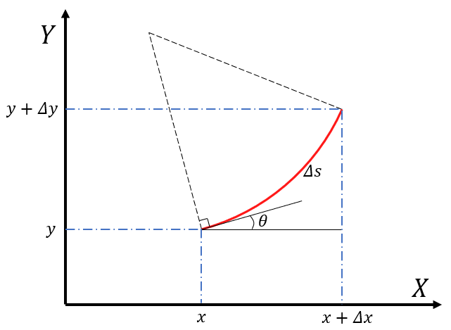

# Kinematics
两轮差速轮机器人在全局参考坐标系下的位姿为 $\mathbf{x} = [x, y, \theta]^T$ ，其中 $x$ 和 $y$ 表示机器人的位置， $\theta$ 表示机器人的航向角，其运动学方程 $\dot{\mathbf{x}} = \mathbf{f}(\mathbf{x})$ 如下所示：

$$
\begin{cases}
\begin{aligned}
    \dot{x} &= v \cos \theta \\
    \dot{y} &= v \sin \theta \\
    \dot{\theta} &= \omega 
\end{aligned} 
\end{cases}
\tag{1}
$$

其中 $v$ 为线速度， $\omega$ 为角速度.

安装在机器人左右两边轮子上的编码器可以测量出轮子在 $\Delta t$ 时间内的转动角度，已知轮子的半径，可以计算在 $\Delta t$ 时间内机器人的左右轮子走过的路程 $\Delta s_l$ 和 $\Delta s_r$ ，假设两个轮子之间的距离为 $L$ ，则机器人在 $\Delta t$ 时间内的航向角变化量为

$$
\Delta \theta = \frac{\Delta s_l}{R - \frac{L}{2}} = \frac{\Delta s_r}{R + \frac{L}{2}} = \frac{\Delta s}{R} \tag{2}
$$

其中， $R$ 为转弯半径. 根据公式 $(2)$ ，可以计算出机器人在 $\Delta t$ 时间内的航向角变化量 $\Delta \theta$ 为

$$
\Delta \theta = \frac{\Delta s_r - \Delta s_l }{L} \tag{3}
$$

也可以计算出机器人在 $\Delta t$ 时间内的路程变化量 $\Delta s$ 为

$$
\Delta s = \frac{\Delta s_r + \Delta s_l }{2} \tag{4}
$$

以下介绍两种方法，根据编码器得到的左右轮子走过的路程 $\Delta s_l$ 和 $\Delta s_r$ ，计算机器人在参考坐标系下的位姿 $[x, y, \theta]^T$ .

### 方法1

离散状态方程的一般形式为 $\mathbf{x}_{k+1} = \mathbf{x}_k + \Delta \mathbf{x}_k$ ，即

$$
\begin{cases}
\begin{aligned}
    x_{k+1} &= x_k + \Delta x_k \\
    y_{k+1} &= y_k + \Delta y_k \\
    \theta_{k+1} &= \theta_k + \Delta \theta_k 
\end{aligned} 
\end{cases}
\tag{5}
$$

假设 $\Delta t$ 足够小，机器人在 $\Delta t$ 时间内的运动过程可以近似为匀速直线运动. 

根据假设，机器人在 $k$ 时刻的路程变化量为 $\Delta s_k \simeq \Delta t \cdot v_k$ ， $x$ 位置的变化量 $\Delta x_k \simeq \Delta s_k \cdot \cos \theta_k$， $y$ 位置的变化量 $\Delta y_k \simeq \Delta s_k \cdot \sin \theta_k$，则

$$ 
\begin{cases}
\begin{aligned}
    x_{k+1} &= x_k + \Delta s_k  \cdot \cos \theta_k \\
    y_{k+1} &= y_k + \Delta s_k  \cdot \sin \theta_k \\
    \theta_{k+1} &= \theta_k + \Delta \theta_k 
\end{aligned} 
\end{cases}
$$

机器人在 $k$ 时刻的航向角变化量 $\Delta \theta_k = \Delta t \cdot \omega_k$ ，结合公式 $(3)$ 和公式 $(4)$ ，可以得到：

$$ 
\begin{cases}
\begin{aligned}
    x_{k+1} &= x_k + \frac{\Delta s_{r,k} + \Delta s_{l,k} }{2} \cos \theta_k \\
    y_{k+1} &= y_k + \frac{\Delta s_{r,k} + \Delta s_{l,k} }{2} \sin \theta_k \\
    \theta_{k+1} &= \theta_k + \frac{\Delta s_{r,k} - \Delta s_{l,k} }{L} 
\end{aligned} 
\end{cases}
\tag{6}
$$

使用公式 $(6)$ 可以实现根据编码器数据更新机器人在参考坐标系下的位姿. [Rohan P. Singh在github的开源代码](https://github.com/rohanpsingh/encoder-odometry/blob/master/encoder_odometry/src/odometry.cpp)就是根据这样的方法计算轮式里程计.

### 方法2

假设 $\Delta t$ 较大，并且机器人在 $\Delta t$ 时间内的线速度和角速度保持不变，机器人在 $\Delta t$ 时间内的运动过程可以用圆弧运动来近似. 

根据假设，结合公式 $(3)$ 和公式 $(4)$ ，机器人在 $k$ 时刻的转弯半径 $R_k$ 为

$$
R_k = \frac{\Delta s_k}{\Delta \theta_k} = \frac{L}{2} \cdot \frac{\Delta s_{r,k} + \Delta s_{l,k}}{\Delta s_{r,k} - \Delta s_{l,k}} \tag{7}
$$

如上图所示，机器人在 $k$ 时刻的 $x$ 位置的变化量 $\Delta x_k$ 和 $y$ 位置的变化量 $\Delta y_k$ 可以分别表示为

$$
\begin{cases}
\begin{aligned}
    \Delta x_k &=  R_k \cdot \sin (\theta_k + \Delta \theta_k) - R_k \cdot \sin \theta_k \\
    \Delta y_k &= -R_k \cdot \cos (\theta_k + \Delta \theta_k) + R_k \cdot \cos \theta_k
\end{aligned}
\end{cases}
\tag{8}
$$

结合公式 $(3)$ 和公式 $(8)$ ，可以得到：

$$ 
\begin{cases}
\begin{aligned}
    x_{k+1} &= x_k + R_k \cdot \sin (\theta_k + \Delta \theta_k) - R_k \cdot \sin \theta_k \\
    y_{k+1} &= y_k - R_k \cdot \cos (\theta_k + \Delta \theta_k) + R_k \cdot \cos \theta_k \\
    \theta_{k+1} &= \theta_k + \frac{\Delta s_{r,k} - \Delta s_{l,k} }{L} 
\end{aligned} 
\end{cases}
\tag{9}
$$

使用公式 $(7)$ 和公式 $(9)$ 可以实现根据编码器数据更新机器人在参考坐标系下的位姿. [Autonomy Lab at SFU在github上开源的iRobot扫地机驱动](https://github.com/AutonomyLab/libcreate/blob/master/src/create.cpp)就是根据这样的方法计算轮式里程计.

参考文档：
- Siegwart, Roland, and Illah R. Nourbakhsh. "Introduction to Autonomous Mobile Robots." Intelligent robotics and autonomous agents (2004).
- [ARW – Lecture 01 Odometry Kinematics](https://www.hmc.edu/lair/ARW/ARW-Lecture01-Odometry.pdf)
